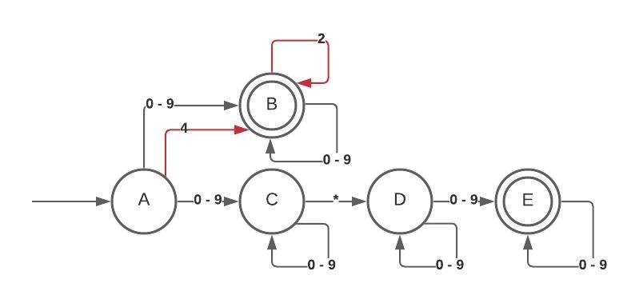
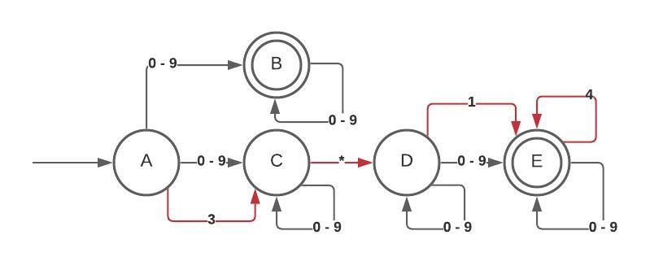
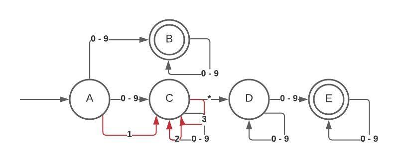
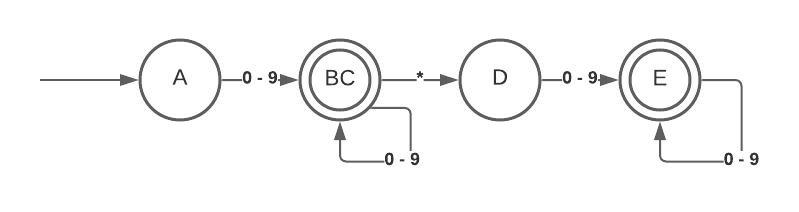
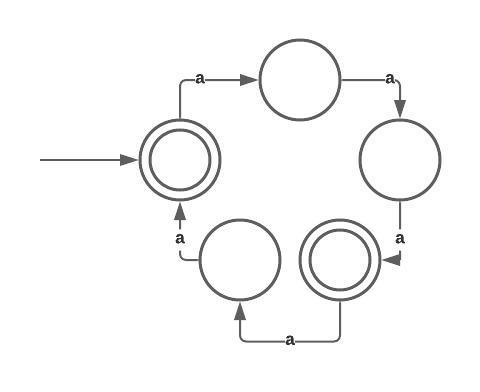

# NFA-REPR

## Q1

### 1 

- A transições que saem do pnto inicial A, possuem mais de um caminho que pode ser escolhido fazendo com que assim sejam um NFA.

### 2

- **42**
OK

- **3.14**
OK

- **123.**
ERROR

### 3

||0-9|*|
|:-:|:-:|:-:|
|-> A|BC|---
|***BC***|BC|D
|D|E|---
|***E***|E|---

## Q2

